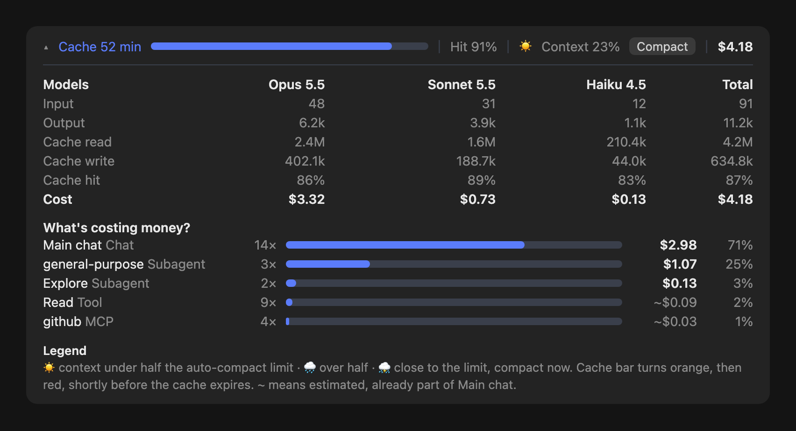

# cache-wetter: Cache-Timer und API-Kosten für Claude Code

[English](README.md)



Ein kleines Claude-Code-Plugin mit einer Leiste über dem Eingabefeld. Sie zeigt, wie lange der Prompt-Cache noch warm ist, wie voll der Kontext ist und was der Chat zu API-Listenpreisen kosten würde, aufgeteilt nach Modell, Unteragent, Skill, MCP-Server und Tool.

Warum: Ein langer Chat, der länger als die Cache-Laufzeit liegen bleibt, wird bei der nächsten Nachricht neu gecacht. Bei 300k Tokens Kontext ist das die teuerste Nachricht des Tages. Die Leiste zeigt den Countdown, damit man rechtzeitig antwortet oder vorher kompaktiert.

## Was sie zeigt

Der Pfeil links schaltet durch drei Größen.

| Größe | Inhalt |
|---|---|
| ▸ klein | Wetter-Symbol, Cache-Minuten, Kontext in %, Gesamtkosten |
| ▾ normal | Cache-Balken, Cache-Hit der letzten Antwort, Kontext in %, Compact-Knopf, Gesamtkosten |
| ▴ groß | Tabelle pro Modell (Input, Output, Cache gelesen, Cache geschrieben, Cache-Hit, Kosten), die 5 teuersten Posten mit Balken und eine Legende |

Wetter: ☀️ Kontext unter der Hälfte der Auto-Compact-Grenze, 🌧 über der Hälfte, ⛈ kurz vor der Grenze (der Compact-Knopf leuchtet). Der Cache-Balken wird unter 25% der Laufzeit orange und unter 10% rot.

## Workers-Board

Solange Subagents laufen, steht pro Agent eine Zeile unter der Leiste: Typ, Aufgabe, Fortschrittsbalken, Tool-Aufrufe und Laufzeit. Der Kreis wird zum grünen Haken, wenn der Agent fertig ist, nach 30 Sekunden verschwindet die Zeile. Höchstens 5 Zeilen.

Claude weiß vorher nicht, wie viele Schritte ein Agent braucht. Der Balken ist deshalb eine Schätzung aus der Zahl der Tool-Aufrufe: Er füllt sich mit jedem Aufruf langsamer und bleibt unter 95 %, bis der Agent wirklich fertig ist.

## Installation

1. Repo herunterladen oder klonen, zum Beispiel nach `~/.claude/mods/cache-wetter`.
2. Den Ordner im `env`-Block von `~/.claude/settings.json` eintragen:

```json
{
  "env": {
    "CLAUDE_CODE_PLUGIN_DIRS": "~/.claude/mods/cache-wetter"
  }
}
```

3. Neuen Chat öffnen. Die Leiste erscheint nach der ersten Antwort.

Braucht eine Claude-Code-Version mit Plugin-Function-Hooks (`ui.render`, `turn.complete`). Getestet mit 2.1.286 in der Desktop-App. Im Terminal sind die Balken aus Zeichen, in der App als SVG.

## Wie die Zahlen entstehen

- Kosten nach API-Listenpreisen pro Million Tokens, Stand 25.09.2026: Fable 5.1 $10 / $50, Opus 5.5 $4 / $20, Sonnet 5.5 $2 / $10, Haiku 4.5 $1 / $5. Cache lesen und Cache schreiben (1,25x Input für 5 Minuten, 2x für 1 Stunde) sind getrennt gerechnet. Mit einem Abo zahlt man diese Beträge nicht. Sie zeigen, was der Chat in API-Preisen wert ist.
- Haupt-Chat und Unteragenten nutzen die genauen Token-Zahlen jeder Antwort.
- Tools, Skills und MCP-Server sind geschätzt und mit `~` markiert: Größe des Ergebnisses geteilt durch 4, berechnet als ein Cache-Schreibvorgang. Der Betrag steckt schon im Haupt-Chat.
- Gezählt wird ab dem Laden des Plugins. Frühere Nachrichten eines fortgesetzten Chats fehlen.
- Die Cache-Laufzeit (5 Minuten oder 1 Stunde) meldet die API nicht. Das Plugin startet mit 60 Minuten und korrigiert sich nach einer Pause zwischen 6 und 55 Minuten.

## Lizenz

PolyForm Strict 1.0.0. Private und andere nicht-kommerzielle Nutzung ist erlaubt. Den Code ändern, darauf aufbauen und weitergeben ist nicht erlaubt. Siehe [LICENSE](LICENSE).
